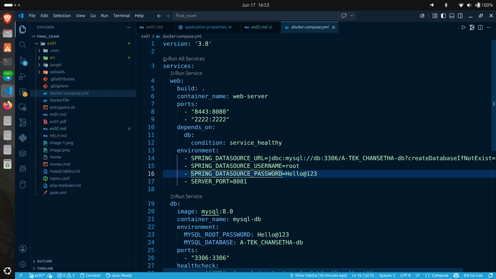
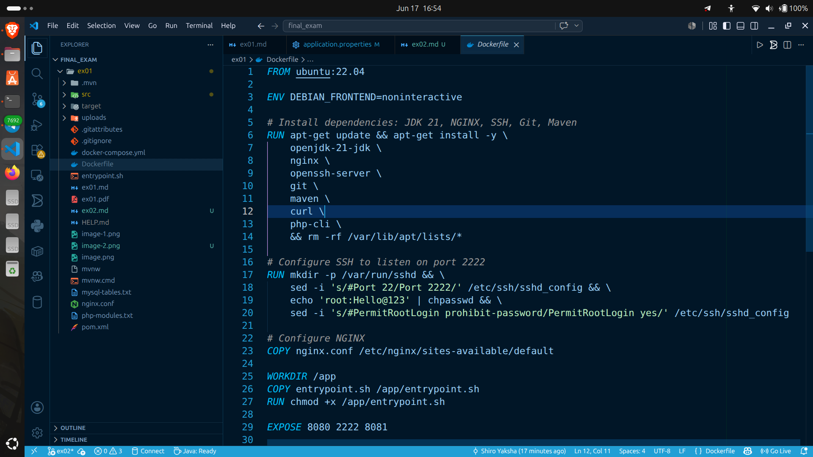
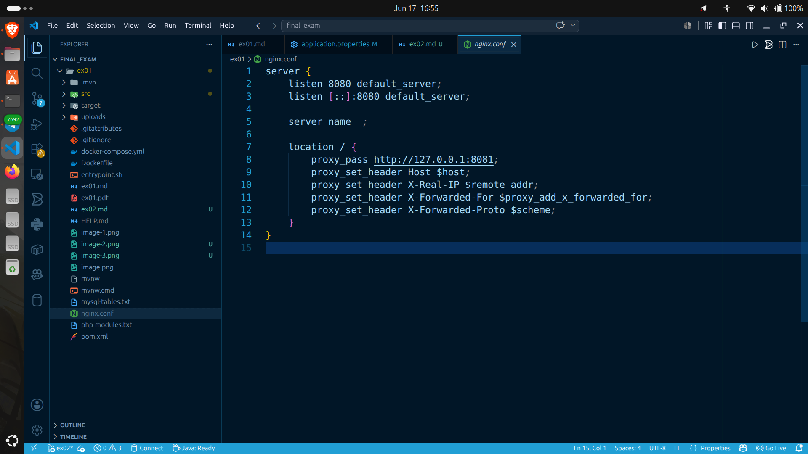
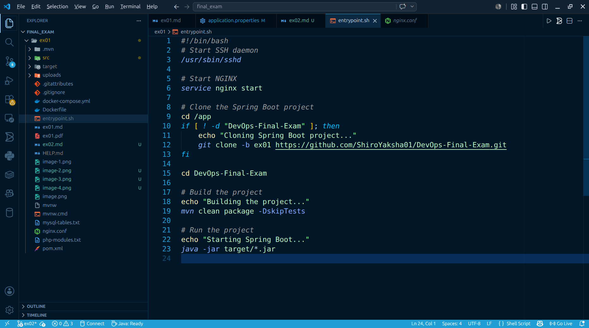

Screenshots of the work

`docker-compose.yml`

`DockerFile`

`nginx.conf`

`entrypoint.sh`

Result outputs

`docker ps`

`curl -I http://localhost:8443`

`docker exec mysql-db mysql -uroot -pHello@123 -e "SHOW DATABASES;"`

`ssh root@localhost -p 2222,`

`mysql table`

`php-module`

